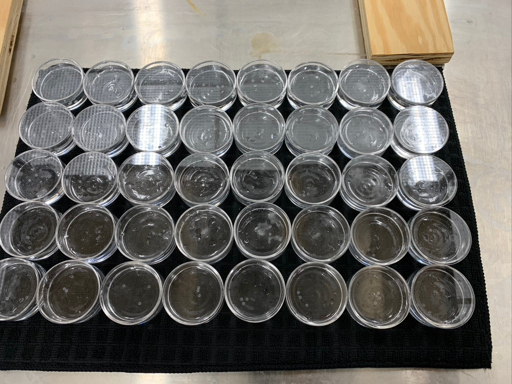

```{r setup, include=FALSE}
knitr::opts_chunk$set(echo = TRUE)
library(tidyverse)
library(knitr)
```


**Revisit the spider cannibalism data!** Let's first get the data entered and the logistic regression model fit re-run from the end of the last session:

```{r}
spider <- read.csv("spiderCannibalism.csv")
spider.fit <- glm(Cannibalism ~ SizeDiff, data=spider, family=binomial(link=logit))
summary(spider.fit)
```


## Variation explained

Like with linear regression, we can use the logistic regression output to estimate the percentage of variability explained by the model. In linear regression, we called this metric $R^2$. In logistic regression, we cannot compute $R^2$ in the same way, but we can estimate what we call a pseudo-$R^2$ using the null deviance and residual deviance. 

```{r}
# Model Variance (Total variance - Residual variance)
model.variance <- spider.fit$null.deviance - spider.fit$deviance
# Pseudo-R^2 (Model variance / Total variance)
model.variance / spider.fit$null.deviance
```

*The model explains 35% of the variability in spider cannibalism.*


## Testing model terms/components

----

### Tests of individual predictors

**Wald z-tests.** Note in the summary output above, a $Z$-test for the significance of each of the predictor variables is provided (this example has only one predictor: `SizeDiff`). Here we see that the size difference between spiders appears to have a significant influence on the probability of cannibalism occuring in these spiders.

**Likelihood Ratio Chi-Square tests (preferred).** The Wald test is generally known to be statistically conservative (fewer Type I errors than what is acceptable).  A generally preferred, and much more flexible, test is the LIkelihood Ratio Chi-Square test (LRT).  The LRT can be used to test the significance of individual predictors (even categorical predictors with multiple levels), sets of predictors (like the reduced *F*-test from earlier this semester), or "whole-model" tests.

To get LRT results of individual predictors in your logistic regression model, use the `drop1()` function:

```{r}
drop1(spider.fit, test="Chisq")
```

There's only one test here because the model only has one predictor.  In a multiple predictor logistic regression, you would see a test for each individual predictor.  Here, we see that size difference is a significant predictor of cannibalism ($\chi^2$ = 18.942, $df$ = 1, $p$-value = 0.00001348).

----

### Whole-model test

We can test the overall significance of the complete model with a likelihood ratio test.  This is the corollary for logistic regression to the "whole-model $F$-test" that we saw in regular linear regression. Suppose you had a model with four predictors `x1`, `x2`, `x3`, and `x4`. In a logistic regression setting, you need to fit a null model with only intercept and use `anova()` with `LRT` to compare the model with four predictors and the null model.

```{r, eval=FALSE}
fit <- glm(response ~ x1 + x2 + x3 + x4, data=whatever, family=binomial(link=logit))
null.fit <- glm(response ~ 1, data=whatever, family=binomial(link=logit))
anova(null.fit, fit, test="LRT")
```

In this example, we have:

```{r}
null.fit <- glm(Cannibalism ~ 1, data=spider, family=binomial(link=logit))
anova(null.fit, spider.fit, test="LRT")
```

Note this is the same result that we got earlier.  Because this model only contains one predictor, the "whole-model" test is the same as the test for the single predictor.  The $\chi^2$-statistic here is labeled `Deviance`.

----

### Reduced-model tests

Suppose you had a model with four predictors `x1`, `x2`, `x3`, and `x4`.  If you wanted to test the single hypothesis at least one of `x3` or `x4` is significant, we can do it by performing an ANOVA-type test for comparing models. Recall the strategy: you would fit a model containing all four predictors (the *full* model) and a *reduced* model obtained by removing the subset of variables under investigation.  Comparing these models assesses the impact of `x3` and `x4` ... if the test result is significant, then at least one of `x3` or `x4` is important. In a logistic regression setting, the code for this would be

```{r, eval=FALSE}
full.model <- glm(response ~ x1 + x2 + x3 + x4, data=whatever, family=binomial(link=logit))
reduced.model <- glm(response ~ x1 + x2, data=whatever, family=binomial(link=logit))
anova(reduced.model, full.model, test="LRT")
```

This can be illustrated in the spider example by comparing a model with `SizeDiff` (the *full* model) to a model with no predictors at all (i.e. an intercept-only model ... this would be the *reduced* model in the illustration):

```{r}
full <- glm(Cannibalism ~ SizeDiff, data=spider, family=binomial(link=logit))
reduced <- glm(Cannibalism ~ 1, data=spider, family=binomial(link=logit))
anova(reduced, full, test="LRT")
```

Since there is only one predictor in this model, this test is the same as the whole-model test. This test tells us that the size difference does influence the probability of cannibalism occuring. You will also note this is the same as the above result except here it is done by comparing two different models. 

----

## Confidence intervals

We can also find confidence intervals for our estimated $\beta$-parameter values:

```{r, message=FALSE}
confint(spider.fit)
```

It is **very important** to consider the interpretation of confidence intervals in logistic regression. These are confidence intervals for the coeffecients in the model **in terms of the log odds**.  If we want to get rid of the log part, we need to take exponents.

```{r, message=FALSE}
exp(confint(spider.fit))
```

So a one unit change in size difference will increase the odds of cannibalism by between 4.22 and 245.18 (a huge range). But is important to note this change is all relative to the intercept. A one-unit increase in size may increase the odds by as much as 245 times, but the **original** odds were 0.006 to 0.174. So even in the most extreme case (in terms of 95\% confidence intervals), a one-unit increase in size difference will increase the odds from 0.1743 to 42.7 ($0.174\times 245$). 

**How does that affect the probability?** Good luck! We can complete the inverse logit transformation using the formula from last session:

```{r, message=FALSE}
exp(confint(spider.fit))/(1+exp(confint(spider.fit)))
```

We see a range of probabilities, but interpretation is quite difficult here. The intercept has interpretation since this corresponds *specifically* to no size difference, where the probability of cannibalism is between 0.006 and 0.148. However, the size difference coefficient is pretty much meaningless here since the original model has been transformed so much.


----

### Fitted plot

Technically our response is the log odds. If we wanted to make a "fitted" plot, we need to transform the output from the `predict()` function.

```{r}
predict(spider.fit)
```

The output here are **model-predicted log-odds of cannibalism** for each of the individual data points (see both negative and positive values). We can get predicted probabilites instead with a minor change to the code:

```{r}
predict(spider.fit, type="response")
```

Now all values are between 0 and 1! 

Technically, a logistic function is a smooth S-curve. If we plotted the above values it would look fairly jagged, so to get a smooth curve we create a new dataset with many `SizeDiff` values (we did this before with log/exp of linear models) and then just run the `predict()` function on these values. By default, `predict()` outputs logs of odds, so we specify `type="response"`. 

```{r}
spider.fit.plot.data <- data.frame(SizeDiff=seq(-1.2, 2.2, 0.01))
spider.fit.plot.data <- spider.fit.plot.data %>% 
  mutate(Predicted.Prob = predict(spider.fit, newdata=spider.fit.plot.data, type="response"))

head(spider.fit.plot.data)

ggplot() + 
  geom_jitter(data=spider, aes(x=SizeDiff, y=Cannibalism), height=0, width=0.1, alpha=0.4) +
  geom_line(data=spider.fit.plot.data, aes(x=SizeDiff, y=Predicted.Prob)) + 
    labs(x="Size Difference (mm) (Female - Male)",
       y="Probability of Cannibalism", 
       title="Postmating Cannibalism in Wolf Spiders") + 
  theme_classic()
```

```{r, eval=FALSE, echo=FALSE}

ggplot(data=spider, aes(x=SizeDiff, y=Cannibalism)) + 
  geom_jitter(height=0, width=0.1, alpha=0.4) +
  geom_smooth(method = "glm", method.args = list(family = "binomial"), se = FALSE) + 
    labs(x="Size Difference (mm) (Female - Male)",
       y="Probability of Cannibalism", 
       title="Postmating Cannibalism in Wolf Spiders") + 
  theme_classic()

```


**Can we perform multiple logistic regression?** Yes!!! You will see that in today's activity.  Before you do that, let's look at another example where the form of the data is presented differently.  And just to keep things consistent, we stick with the topic of cannibalism!


----

## Logistic regression from summarized data

With 0/1 binary response data, the response variable's values can be presented to R in one of two ways: by either a vector of 0's and 1's, or a matrix with two columns.  This latter way is sometimes the way data appears in studies where all the predictors are categorical. Consider the following depresing example (!):

### Example: The Donner Party

(Adapted from https://study.com/academy/lesson/the-donner-party-facts-summary.html):

By 1846, more and more people were picking up and moving west to states like Oregon, Utah and California. George Donner was the organizer of the Donner Party expedition. His advertisement in the Springfield, Illinois Gazette invited anyone who wanted to travel to California for free land to join him. Many families eager for the promise of land answered Donner's call to pursue the American dream.

On April 16, 1846, a group of 87 men, women and children left Illinois and began the long journey to California with the hope of arriving before the winter snows began in the Sierra Nevada Mountains.

<div style="float:right;position: relative; ">
```{r, out.width = "200px", echo=FALSE}
knitr::include_graphics("http://www.users.miamioh.edu/hughesmr/hastingscutoff.gif")
```
</div>

The Donner Party made a fateful error when they decided to try a untested shortcut known as the Hastings Cutoff.  Normally, travelers went north around the Great Salt Lake into Idaho before turning south again back into Nevada. However, a new route promising a straighter and faster passage south of the Great Salt Lake was suggested by land promoter Lansford Hastings in his book, *The Emigrants' Guide to Oregon and California*. As it turns out, Hastings had never actually traveled this route and had no idea if wagons could handle the trail.

In actuality, the cutoff was not accessible for wagons and cattle, and was many miles longer. The "shortcut" put the Donner Party weeks behind schedule, and when they reached the eastern side of the Sierra Nevada Mountains in late October, an early blizzard hit and snowed them in on Truckee Lake. It would turn out to be one of the worst winters in the history of the Sierra Nevadas where the snowpack can pile up to 30 feet deep. For five months, the Donner Party was stranded with no food, and no chance for escape or rescue.  They butchered the cattle they had, but many of the cows had wandered off or died in the snow. They soon turned to boiling leather shoestrings and hides for food, and as members of the party succumbed to the cold, some of the survivors tragically resorted to cannibalism of their friends and family.

The present data set contains actual information about survival counts by gender for the 87 members of the Donner party.

```{r}
donner <- read.csv("donnerparty.csv")
print(donner)
```

As you can see, the data are not presented as 87 rows (one per subject) as we are used to seeing.  Instead, the response information is summarized in two columns, where one column contains a summary total count of "successes" for the given row, and the other column contains a summary total count of "failures" for the given row.  In this problem, there are only two genders, so we have a two rows of success/failure counts, one for each gender.

Fortunately, handling this format for logistic regression data is easy in R.  All we need to do is make a slight change in the `glm` statement whereby we **bind** the two columns together in a matrix using the `cbind` function.  Here is the code for doing the logistic regression using this format, modeling the probability of survival for Donner Party members based on their gender:

```{r}
donner.fit <- glm(cbind(survived, died) ~ gender, data=donner, family=binomial(link=logit))
```

Note that the general format is `cbind(successcolumn, failurecolumn)`.

Some quick analysis:

**LRT test to see if $P(survival)$ is related to gender:** *(done as a "whole-model" test)*

```{r}
donner.null.fit <- glm(cbind(survived, died) ~ 1, data=donner, family=binomial(link=logit))
anova(donner.null.fit, donner.fit, test="LRT")
```

The probability of survival in the Donner Party is significantly different between the genders ($\chi^2$ = 5.076, $p$-value = 0.02426).

**Parameter estimate interpretation:**

```{r}
summary(donner.fit)
```

* $\hat{\beta_1}$ = `r coef(donner.fit)[2]`: The `gender` predictor here is expressed as an indicator variable of being **male**.  Since the parameter estimate is negative, it tells us that the log odds of survival for males is *smaller* than for females.  Re-expressing as odds:

```{r, message=FALSE}
exp(coef(donner.fit)[2])
```

The odds of a male surviving is 0.363 times that of a female surviving. From an inferential perspective,

```{r, message=FALSE}
exp(confint(donner.fit))
```

We can be 95% confident that a male is 0.142 to 0.878 times as likely to survive as compared to a female. (Note that you can "flip" this and re-express from the female size by taking reciprocals of the odds: We can be 95% confident that a female is 1.138 to 7.042 times as likely to survive as compared to a male.)

*QUESTION*: Interpret the confidence interval for the intercept $\beta_0$ above.


**Predicted probabilites of survival:**

We can use type="response" in the predict() function in R to get the predicted probabilities. Note: if you do not include type="response", then the output will instead be the predicted log odds. 

```{r}
predict(donner.fit, type="response")
```

The model predicts that males have a 44.23% probability of survival; for females, the survival probability is estimated at 68.57%; which corresponds to the exact probabilities within the two groups.


# In-class Assignment

## Data - Mosquitos

An experiment was conducted by Miami University Biology student, Nikki Berry, looking at the effects of UV radiation and dissolved organic matter (DOM) in water on the survival rates of mosquito larvae, see <a href="https://journals.plos.org/plosone/article?id=10.1371/journal.pone.0240261">Dissolved organic matter protects mosquito larvae from damaging solar UV radiation.</a> The relevant data from this experiment are in the file `berryMosquitoData.csv`.

```{r}
mosquitos <- read.csv("berryMosquitoData.csv")
glimpse(mosquitos)
```

</img>

In the experiment, mosquito larvae (*C.\ pipiens* and *C.\ restuans*) were collected as egg rafts from ovipositing traps. All larvae were homogenously mixed into a large container before being used for the experiment. A random sample of larvae (between 5 and 10) were placed in a dish under some experimental conditions. Some dishes contained clear water (`DOM=0`), while other dishes contained a concentration of Dissolved Organic Matter in the water (`DOM=1`). All dishes were then exposed to two different sources of radiation, a no light (dark) setting (`UVB=0`) and in the presence of an artificial Ultra Violet lamp (`UVB=1`). A visual display of the dishes involved in the experiment is included to the right. 

After 12 hours of exposure to the experimental conditions, the mosquito larvae were scored for survivorship (alive or dead). 


## Question 1

You should note this is a <u>designed experiment</u> but the underlying response variable is not a measurement. Describe the following:

* Experimental Units: **Mosquito Larvae**
* Factors and levels of study: **Light or Dark Setting**
* Treatments in this experiment: **Time**
* The response with respect to the experimental units? **If they are dead or alive**


## Question 2

Think back to our discussions from Module 3 (two-factor ANOVA), what is the the appropriate hypothesis we wish to test for this experiment? 

**We want to see if the lightness or darkness is affecting the survival rates of mosquito larvae.**


## Question 3

Technically we cannot run an ANOVA analysis on this data, but we can use the `anova()` function to get at the underlying hypothesis test of interest.

Fit a main effects logistic regression model called `main_fit`, and a model with interactions, called `int_fit`, where the survivorship is modeled as a function of the two factors of study. Look at the Donner party example in the notes above for coding help. 


```{r}
main_fit <- glm(cbind(Alive, Dead) ~ DOM + UVB, data=mosquitos, family=binomial(link=logit))
int_fit <- glm(cbind(Alive, Dead) ~ DOM * UVB, data=mosquitos, family=binomial(link=logit))
```


## Question 4

Use the `anova()` function to perform an **Analysis of Deviance** (likelihood ratio test) to determine if the interaction between DOM and UVB significantly predicts the survivorship of mosquito larvae. Make sure to include the Likelihood Ratio Test in the `anova()` call.

```{r}
anova(int_fit, main_fit, test="LRT")
```

**Based on our P-Value we can see that there is a signifcant difference between having light and not having light in the surival rates.**


## Question 5

Look at the coefficients for the fitted *interaction* model in part 3 (use either `summary()` or `coef()`). Use these coefficients to calculate and interpret the odds of mosquito survivorship for all treatments in context. Note, this question is lengthy because of the number of interpretations.


```{r}
summary(int_fit)
```


```{r}
exp(2.8103)
```

**The odds when there is clear water and it is dark, the odds of survival is 16.615**


```{r}
exp(2.8103 + 0.3537)
```

**The odds when there is not clear water and it is dark, the odds of survival is 23.66507**


```{r}
exp(2.8103 + (-4.5643))
```

**The odds when there is not clear water and it is light is 0.173**


```{r}
exp(2.8103 + 3.2104)
```

**The odds of the interaction of the water and the light is 411.87**


